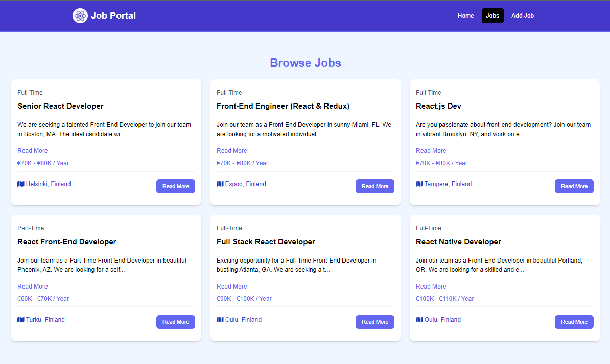
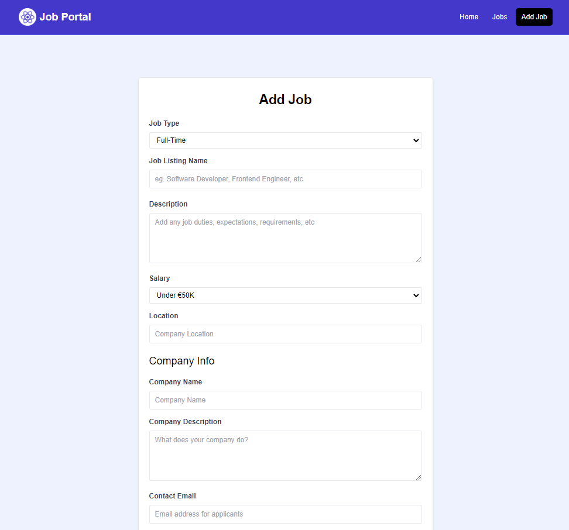

# React + Vite + TailwindCSS Project

This project is a job portal built using React, Vite, and TailwindCSS. It's a showcase project demonstrating proficiency in modern web development technologies and techniques, including state management with React's useState and useEffect hooks, routing with React Router, and styling with TailwindCSS.

## Project Scope

This project is a demonstration of a job portal where job seekers/poster can browse through the available jobs and update/delete them. It's not intended for production use, but rather as a showcase of my skills in React, Vite, and TailwindCSS.

## Features

- Job Listing: Displays a list of jobs available.
- Job Updating: Allows updating jobs.
- Job CRUD function with notification

## Technologies Used

- [React](https://reactjs.org/): A JavaScript library for building user interfaces. In this project, I've used React's useState and useEffect hooks for state management and side effects respectively.
- [React Router](https://reactrouter.com/): Used for managing routing in the application.
- [Vite](https://vitejs.dev/): A build tool that aims to provide a faster and leaner development experience for modern web projects.
- [TailwindCSS](https://tailwindcss.com/): A utility-first CSS framework for rapidly building custom user interfaces.
- [JSON Server](https://github.com/typicode/json-server): Used as a mock backend to simulate CRUD operations.

## Plugins Used

- [@vitejs/plugin-react](https://github.com/vitejs/vite-plugin-react/blob/main/packages/plugin-react/README.md): Uses [Babel](https://babeljs.io/) for Fast Refresh.
- [react-icons](https://react-icons.github.io/react-icons/): Used for adding icons to the application.
- [react-spinners](https://www.davidhu.io/react-spinners/): Used for displaying loading spinners while data is being fetched.
- [react-toastify](https://fkhadra.github.io/react-toastify/introduction/): Used for displaying notifications in the application.

## Preview

Here are some screenshots of the project:





## Getting Started

To get a local copy up and running follow these simple steps.

### Prerequisites

- npm
  ```sh
  npm install npm@latest -g

  ```

### Installation

1. Clone the repo
   ```sh
   git clone https://github.com/salscoding/react-job-portal.git
   ```
2. Install NPM packages
   ```sh
   npm install
   ```
3. Start the project
   ```sh
   npm run dev
   ```

### License MIT

Special Thanks to @bradtraversy
